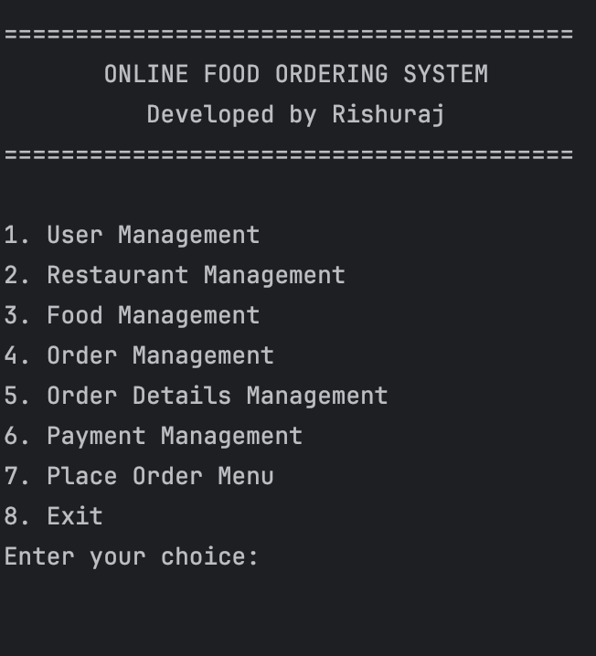
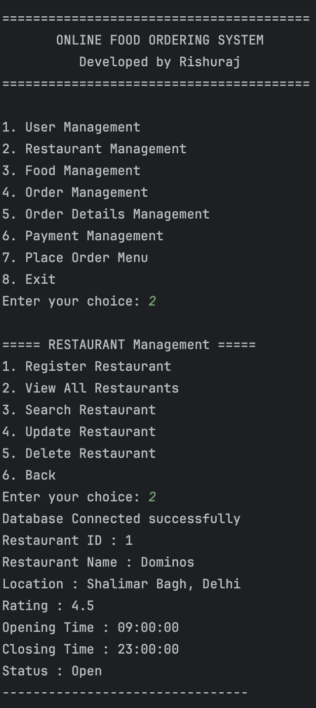
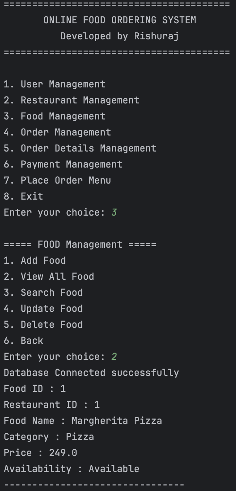
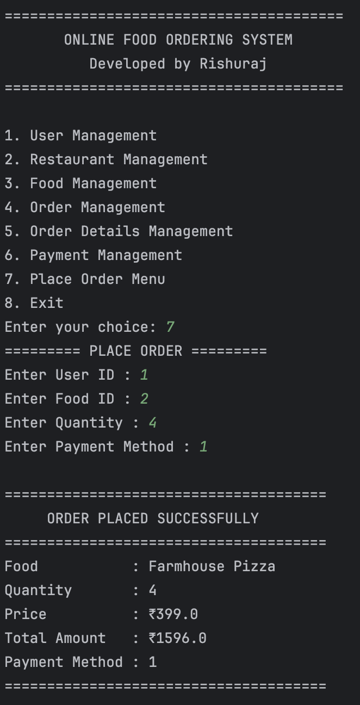

# 🍔 Online Food Ordering System

A Java console-based application developed using Java, JDBC, and MySQL for managing an online food ordering system. The project demonstrates database connectivity, object-oriented programming, and CRUD operations through a menu-driven interface.

##  Application Screenshots

|                     Main Menu                     |                  Restaurant Management                  |                  Food Management                  |                       Place Order                       |
|:-------------------------------------------------:|:-------------------------------------------------------:|:-------------------------------------------------:|:-------------------------------------------------------:|
|  |  |  |  |

---

---
## Badges 


## Features

- User Management
- Restaurant Management
- Food Management
- Order Management
- Order Details Management
- Payment Management
- Place Order Module

## Technologies Used

- Java
- JDBC
- MySQL
- Maven
- IntelliJ IDEA

## Project Structure

```
src
└── main
    └── java
        └── com.rishuraj
            ├── database
            ├── model
            ├── service
            └── Main.java
```

## About the Project

This project was developed to strengthen my understanding of Java, JDBC, MySQL, object-oriented programming, and database-driven application development. It provided hands-on experience in designing a structured backend application and implementing CRUD operations using SQL.
... 
## How to Run

1. Clone the repository.
2. Create the MySQL database.
3. Update the database credentials in `DatabaseConnection.java`.
4. Build the project using Maven.
5. Run `Main.java`.

---

## What I Learned

- Built a Java application using JDBC and MySQL
- Performed CRUD operations using PreparedStatement
- Designed a relational database with foreign keys
- Implemented order placement with automatic ID generation
- Used Git and GitHub for version control
- Organized the project using models and service classes

## Future Improvements

- Develop a web-based version using Spring Boot and REST APIs.
- Build a responsive frontend for customers and administrators.
- Add user authentication and role-based access (Admin & Customer).
- Implement order history and order tracking.
- Improve input validation and exception handling.
- Deploy the application on a cloud platform.

## Note

This project was developed as part of my learning journey in Java backend development and database-driven application development.

**Rishuraj**

B.Tech Electrical Engineering

Netaji Subhas University of Technology (NSUT)